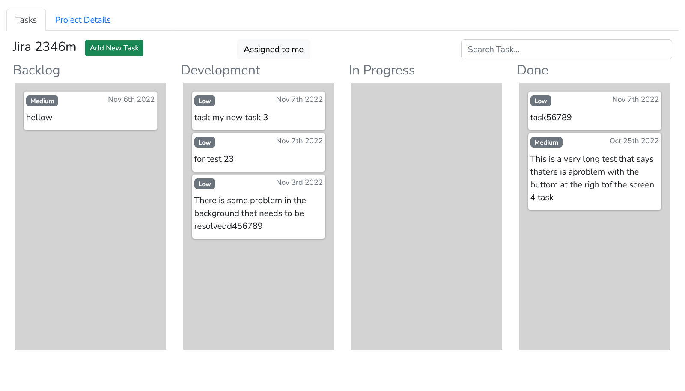

# Bug Tracker

Free and Open Source project management software. This application was developed using Laravel for the backend and using React on the front end.

## Demo

Demo of this application is available at [shankarammai.com.np/BugTracker](shankarammai.com.np/BugTracker).

## Features
- Multi-user with multiple roles support
- KanbanBoard to convenient manage tasks and bugs
- Interactive Drag and Drop support
- Supports wysiwyg editor

## Authors
- [@shankarammai](https://www.github.com/shankarammai)

## Screenshot of the application

